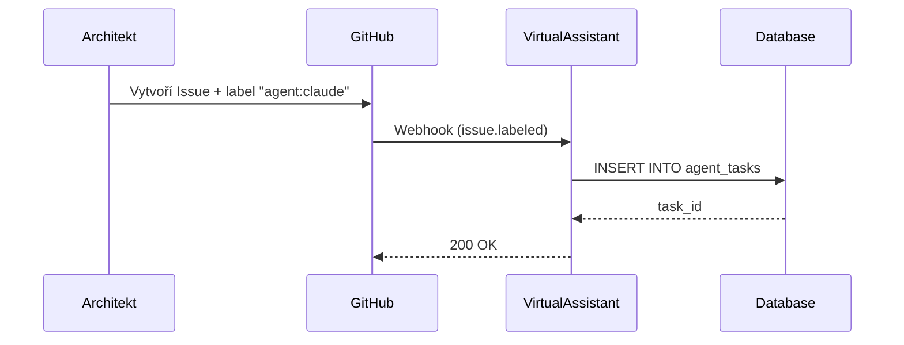
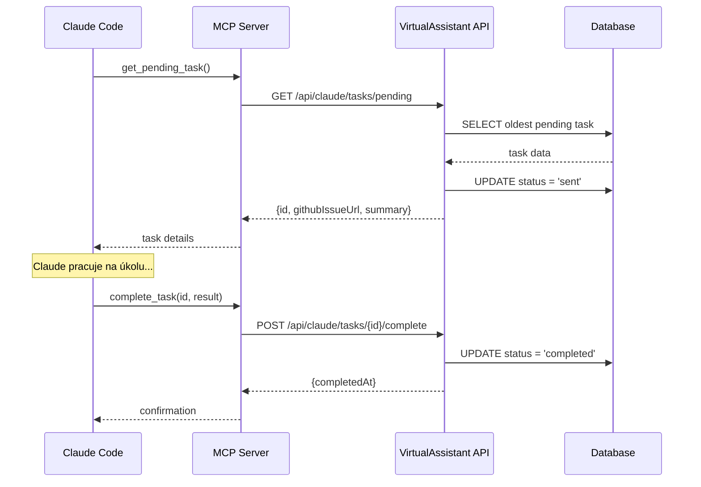

# Architektura

Tato stránka popisuje architekturu integrace ClaudeCode s VirtualAssistant systémem.

## Přehled systému

```
┌─────────────────────────────────────────────────────────────────┐
│                         ARCHITEKT (člověk)                       │
│                                                                 │
│  1. Vytvoří GitHub Issue                                        │
│  2. Přiřadí label "agent:claude"                                │
│  3. VirtualAssistant webhook vytvoří task v DB                  │
└─────────────────────────────────────────────────────────────────┘
                                │
                                ▼
┌─────────────────────────────────────────────────────────────────┐
│                    VIRTUALASSISTANT (C# .NET)                   │
│                                                                 │
│  ┌─────────────┐    ┌─────────────┐    ┌─────────────┐         │
│  │  PostgreSQL │◄───│   REST API  │◄───│   Webhook   │         │
│  │  (tasks)    │    │  /api/claude│    │   Handler   │         │
│  └─────────────┘    └─────────────┘    └─────────────┘         │
│         │                  ▲                                    │
│         │                  │                                    │
└─────────│──────────────────│────────────────────────────────────┘
          │                  │
          │     HTTP REST    │
          │                  │
┌─────────│──────────────────│────────────────────────────────────┐
│         ▼                  │         CLAUDE CODE               │
│  ┌─────────────────────────┴───────────────────┐               │
│  │           MCP Server (TypeScript)            │               │
│  │                                              │               │
│  │  ┌──────────────┐    ┌───────────────────┐  │               │
│  │  │ API Client   │    │    MCP Tools      │  │               │
│  │  │ (fetch+retry)│    │                   │  │               │
│  │  └──────────────┘    │ • get_pending_task│  │               │
│  │         │            │ • complete_task   │  │               │
│  │         └────────────┴───────────────────┘  │               │
│  └──────────────────────────────────────────────┘               │
│                          │                                      │
│                          ▼                                      │
│  ┌──────────────────────────────────────────────┐               │
│  │              Claude AI Agent                  │               │
│  │                                              │               │
│  │  • Načte úkol pomocí get_pending_task        │               │
│  │  • Otevře GitHub issue                       │               │
│  │  • Implementuje řešení                       │               │
│  │  • Nahlásí dokončení pomocí complete_task    │               │
│  └──────────────────────────────────────────────┘               │
└─────────────────────────────────────────────────────────────────┘
```

## Komponenty

### 1. VirtualAssistant (C# .NET Backend)

**Repozitář:** [Olbrasoft/VirtualAssistant](https://github.com/Olbrasoft/VirtualAssistant)

Centrální systém pro správu AI agentů. Poskytuje:

- **REST API** pro správu úkolů (`/api/claude/tasks/*`)
- **Webhook handler** pro GitHub events
- **Database** pro perzistenci úkolů
- **Agent management** (Claude, Gemini, apod.)

#### API Endpoints

| Endpoint | Metoda | Popis |
|----------|--------|-------|
| `/api/claude/tasks/pending` | GET | Vrátí nejstarší pending task |
| `/api/claude/tasks/{id}/complete` | POST | Označí task jako dokončený |

### 2. MCP Server (TypeScript)

**Umístění:** `mcp-task-dispatch/`

Model Context Protocol server, který běží jako child process Claude Code a poskytuje nástroje pro komunikaci s VirtualAssistant.

#### Struktura

```
mcp-task-dispatch/
├── src/
│   ├── index.ts        # MCP server entry point
│   ├── api-client.ts   # VirtualAssistant API client
│   ├── tools/
│   │   ├── get-pending-task.ts
│   │   └── complete-task.ts
│   └── types.ts        # TypeScript interfaces
├── package.json
└── tsconfig.json
```

### 3. Claude Code

Anthropics CLI nástroj, který:
- Spouští MCP servery jako child procesy
- Poskytuje AI agentovi přístup k MCP tools
- Zpracovává úkoly autonomně

## Tok dat

### Vytvoření úkolu



### Zpracování úkolu



## Stavy úkolů

```
pending ──► approved ──► notified ──► sent ──► completed
    │                                    │
    └──────────────► failed ◄────────────┘
```

| Stav | Popis |
|------|-------|
| `pending` | Úkol čeká na schválení |
| `approved` | Architekt schválil úkol |
| `notified` | Notifikace odeslána |
| `sent` | Claude si úkol vyzvedl |
| `completed` | Úkol dokončen |
| `failed` | Úkol selhal |

## Bezpečnost

### Network

- MCP server komunikuje pouze s localhost VirtualAssistant API
- Žádná externí síťová komunikace
- API běží na `http://localhost:5055`

### Authentication

- Aktuálně: Žádná (interní systém)
- Plánováno: API key authentication

### Data

- Citlivá data zůstávají v PostgreSQL
- MCP server neukládá žádná data lokálně
- Logy jsou minimální (žádné task obsahy)
